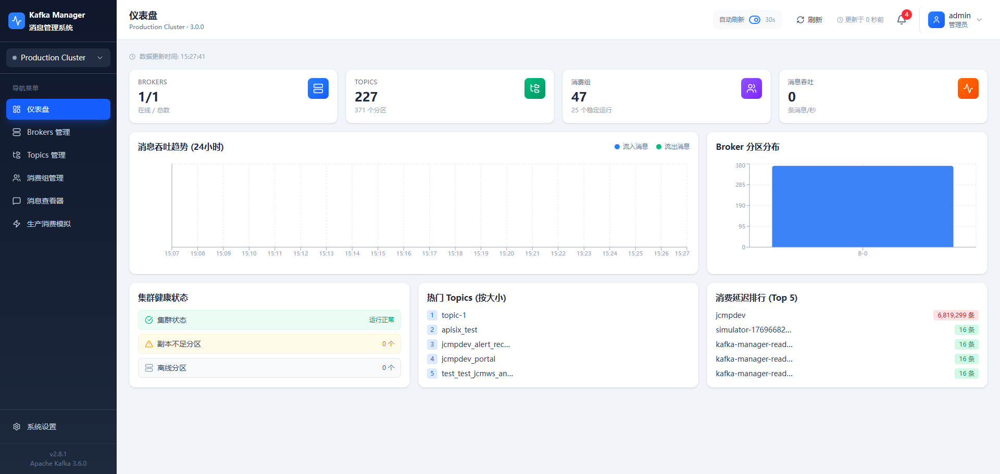
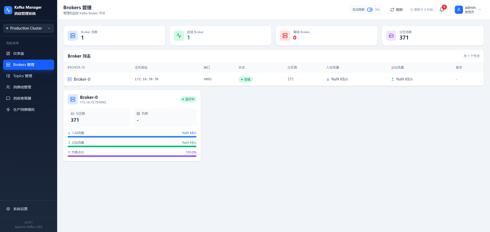
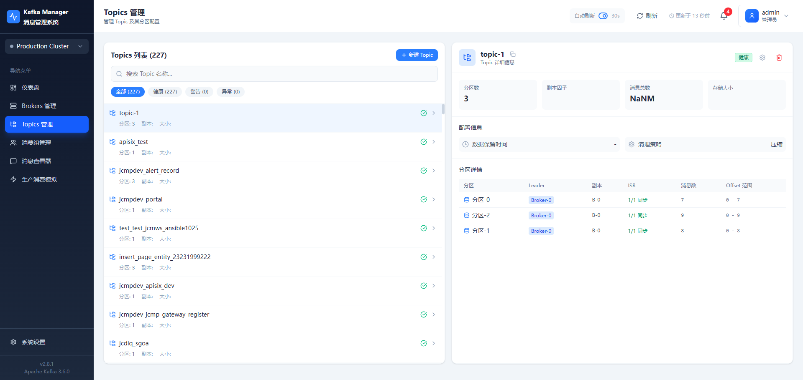
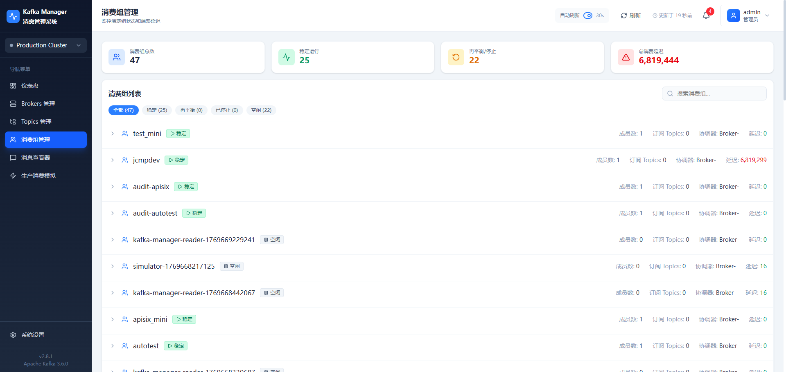
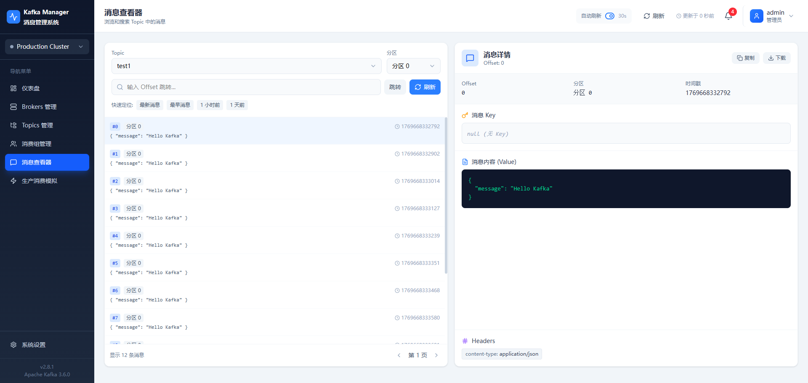
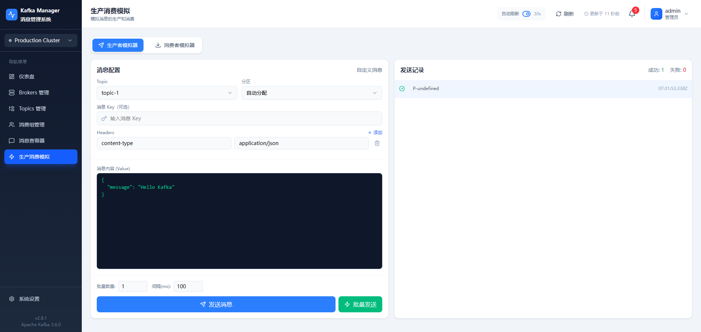

# Kafka Manager

一个现代化的 Kafka 集群管理平台，提供直观的 Web 界面来监控和管理 Apache Kafka 集群。



## ✨ 功能特性

- **集群概览**：实时监控 Brokers、Topics、Partitions 的状态和指标。
- **Topic 管理**：查看、创建、删除 Topic，查看分区详情和配置。
- **消费者组管理**：监控 Consumer Groups，查看消费延迟 (Lag) 和成员状态。
- **消息浏览器**：实时查看 Topic 中的消息，支持搜索和过滤。
- **消息发送**：支持直接从界面发送消息到指定的 Topic。
- **多环境支持**：支持连接真实 Kafka 集群，也提供 Mock 模式用于演示和开发。
- **用户认证**：内置用户管理系统，支持登录、权限控制和个人设置。

## 🛠 技术栈

### 前端 (Frontend)
- **核心框架**：React 19, TypeScript
- **构建工具**：Vite
- **样式方案**：Tailwind CSS v4
- **图表库**：Recharts
- **图标库**：Lucide React
- **状态管理**：React Context + Hooks

### 后端 (Backend)
- **运行环境**：Node.js
- **Web 框架**：Express
- **Kafka 客户端**：KafkaJS
- **数据库**：SQLite (通过 Sequelize ORM)
- **实时通信**：WebSocket (ws)

## 📂 项目结构

```
kafka-manager/
├── backend/                # 后端服务代码
│   ├── data/               # SQLite 数据库文件
│   ├── src/                # 后端源码 (路由, 模型, 服务)
│   └── ...
├── src/                    # 前端源码
│   ├── api/                # API 接口层 (支持 Mock/Real 切换)
│   ├── assets/             # 静态资源 (图片等)
│   ├── components/         # React 组件
│   ├── contexts/           # 全局状态 Context
│   └── ...
├── index.html              # 前端入口 HTML
├── package.json            # 前端依赖配置
└── ...
```

## 🚀 快速开始

### 前置要求
- Node.js (推荐 v16+)
- Apache Kafka (如果使用真实后端)

### 1. 安装依赖

**安装前端依赖**
```bash
npm install
```

**安装后端依赖**
```bash
cd backend
npm install
cd ..
```

### 2. 配置后端

进入 `backend` 目录，复制示例配置文件：

```bash
cd backend
cp .env.example .env
```

编辑 `.env` 文件，配置你的 Kafka 集群地址：

```env
# Kafka 配置
KAFKA_BROKERS=localhost:9092
KAFKA_CLIENT_ID=kafka-manager

# 服务器端口
PORT=3001
WS_PORT=3002
```

### 3. 启动服务

**启动后端服务**
```bash
cd backend
npm run dev
```
后端服务将在 `http://localhost:3001` 启动。

**启动前端服务**
打开一个新的终端窗口：
```bash
npm run dev
```
前端应用将在 `http://localhost:5173` (或其他 Vite 分配的端口) 启动。
默认用户：admin / admin123

### Mock 模式 (可选)

如果你没有本地 Kafka 环境，可以开启前端的 Mock 模式进行体验。
修改 `src/api/config.ts` 中的 `USE_MOCK` 常量为 `true`，或者检查是否有对应的环境变量配置。

## 📸 界面预览

| 概览 | Topic 列表 |
|------|------------|
|  |  |

| 消息查看 | 消费者组 |
|----------|----------|
|  |  |

| 发送消息 | 设置 |
|----------|------|
|  |  |

## 📄 License

MIT
